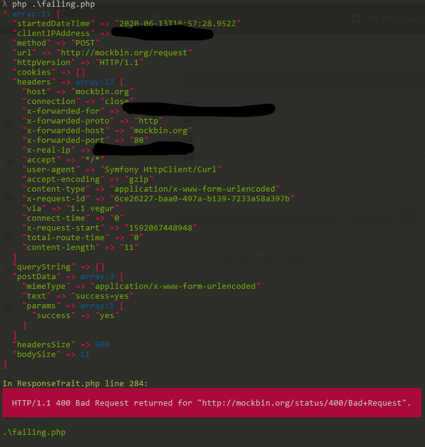

# Multiplexing with HTTP 4XX responses
Why does checking the HTTP status code make it work, while not checking it throws an exception? I don't do anything with the HTTP status code; it feels like magic (or a side effect).

## What happens when I run `failing.php` (the code I expect to work)
* The HTTP 200 response prints
* The HTTP 400 response throws an exception



## What happens when I run `working.php`
This is the same file with a tiny bit of code added:
```php
if ($response->getStatusCode() != 200) {
}
```
* The HTTP 200 response prints
* The HTTP 400 response prints

Note, order or the two responses may vary:


